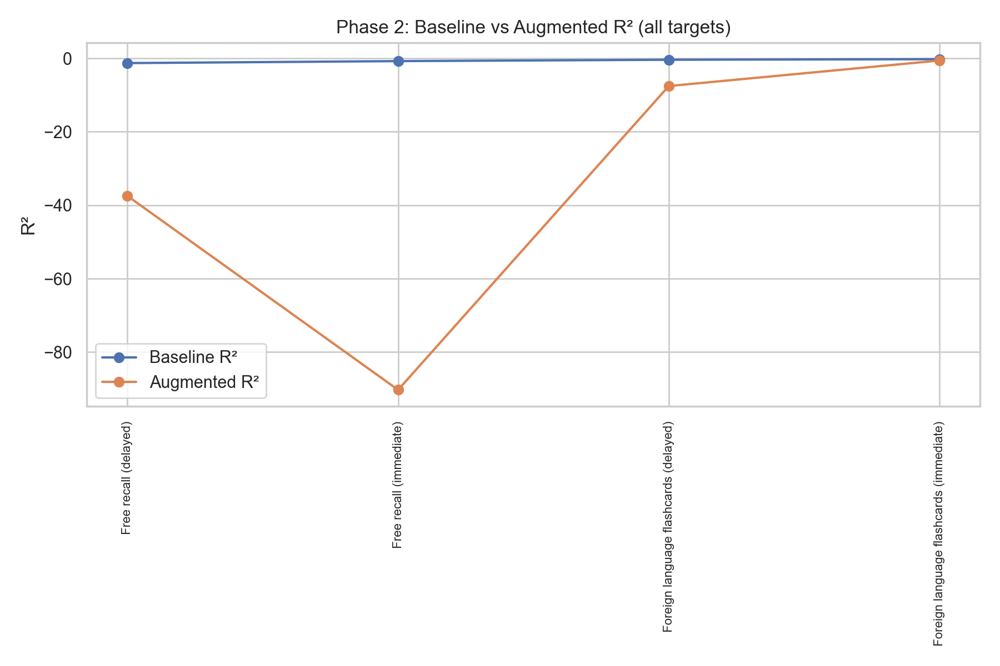
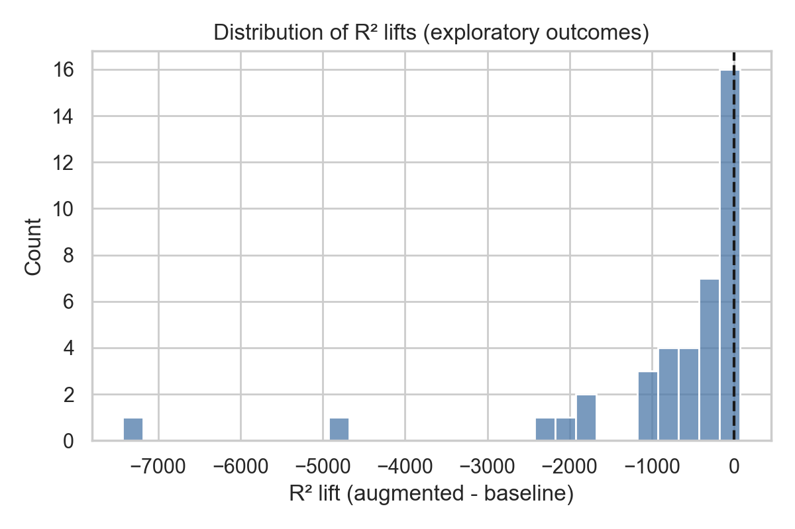
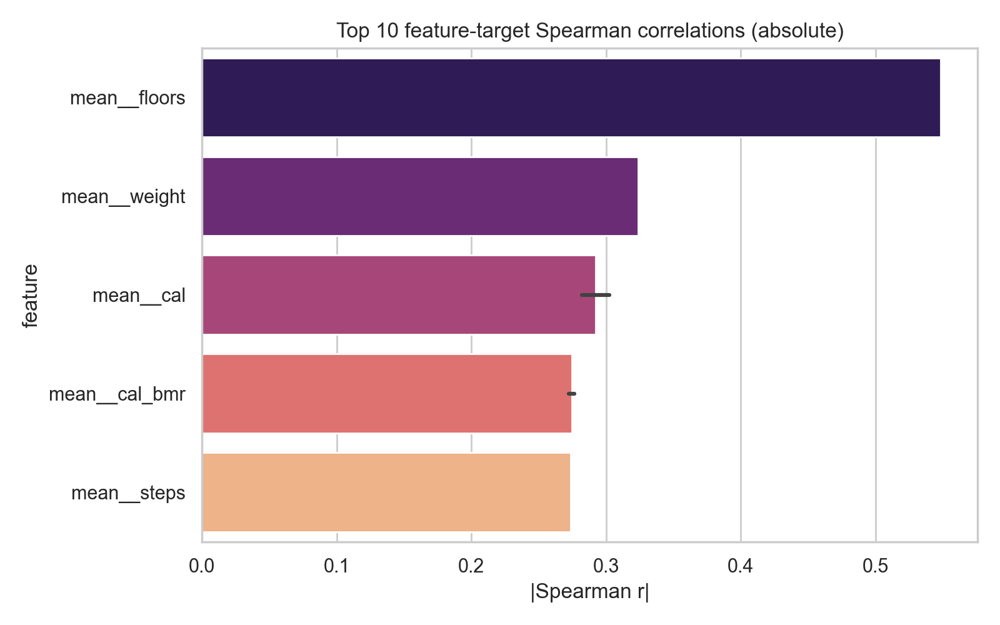

# Fitbit Activity Dynamics and Memory Performance
Author: Kate Marine kate-marine

## Overview

This project tests whether the temporal pattern of someone's Fitbit activity (such how it varies day to day, trends over time, and autocorrelates) predicts memory-task performance beyond what their average activity level already captures. I built two models, one as a baseline using only mean activity, and another with added temporal/dynamic features. I then compared performance with Elastic Net and Random Forest models as well as a univariate screen of 560 feature–outcome pairs. All results concluded that dynamic features add no reliable predictive value over a simple mean-activity baseline.

I confirmed that this null result is not a pipeline bug from a synthetic-signal test which confirmed the cross-validation harness *can* recover a known effect. I then conducted a power analysis which showed that at n = 113 this study could not have reliably detected correlations smaller than |r| ≈ 0.26, so the conclusion is not necessarily proving that no association exists between temporal fitness activity and memory performance but rather that there is no reliable evidence of an association given the limited dataset. 


## Data

I used the public dataset from:

> Manning, J. R., Notaro, G. M., Chen, E., & Fitzpatrick, P. C. (2022). Fitness tracking reveals
> task-specific associations between memory, mental health, and physical activity.
> *Scientific Reports*, 12, 13822. https://doi.org/10.1038/s41598-022-17781-0

It contains, for 113 participants:

- **Raw Fitbit logs** in long format (one file per participant, `BFM_AMT_0001.csv` …
  `BFM_AMT_0113.csv`): rows of `(datetime, variable, value)` spanning roughly a year per person.
  Loading all files yields **803,767 rows** across **130 distinct variables**.
- **Memory outcomes** (`behavioral_summary.pkl`, `behavior.pkl`): summary scores plus 54
  fine-grained task metrics (free recall, foreign-language flashcards, primacy/recency, semantic
  clustering, error-distance measures, etc.).
- **Survey responses** (`survey_30.pkl`): demographics, self-reported stress, exercise habits.

Note: I chose to rebuild from the raw long-format logs rather than use any
pre-collapsed summary because temporal modeling is only possible if the day-level structure is preserved before any aggregation happens.

### Panel construction

The raw long table is converted into a **participant × date panel** with one row per
participant-day and one column per variable. For each participant I reindexed over the full daily date range between their first and last observation, so missing days are represented explicitly as `NaN` rather than dropped. This way a participant who wore the device sporadically should look sparse, not artificially regular, and the dynamic features need a real time axis to measure trend and autocorrelation against.

## Methods

### 1. Signal selection 

Of the 130 raw variables, many are sparse, device-specific, or non-daily (heart-rate zones,
sleep, HRV), which would inject noise into any temporal feature computed from them. I keep a
predefined list of daily wearable signals and then apply a **coverage gate**: a signal is
retained only if

- its **median valid-day count across participants ≥ 300**, and
- it is present for **≥ 60 participants**.

This leaves **14 signals**:

```
bmi  bodyfat  cal  cal_bmr  distance  fair_act_mins  floors
food_cal_log  light_act_mins  sed_mins  steps  very_act_mins
water_log  weight
```

### 2. Feature engineering

**Means-only matrix (113 × 14)** For each participant and signal, the mean over all valid days. This intentionally *ignores* all temporal structure and serves as the baseline model.

**Dynamic matrix (110 × 149)** For each participant–signal time series I compute descriptors of its shape over time:

| Feature | What it captures |
|---|---|
| `std`, `min`, `max`, `range` | day-to-day spread and extremes |
| `trend` (OLS slope), `trend_r2` | drift over the year and how linear it is |
| `acf_lag1`, `acf_lag7` | short-range and weekly autocorrelation |
| `cv` (std / mean) | scale-free variability |
| `pct_valid` | fraction of non-missing days (a data-quality covariate) |

I dropped near-constant columns with a `VarianceThreshold(1e-6)`, and
remaining gaps are median-filled. Concatenating means + dynamics gives the augmented matrix (113 × 163).

Note: you can see that 163 predictors against 113 participants is a p > n problem, and that overfitting risk is the main reason the dynamic model is expected
to struggle.

### 3. Modeling and evaluation

All models run through the same leakage-safe pipeline:

```
median impute  →  standardize  →  regressor
```

Imputation and scaling are fit inside each training fold only and applied to the held-out fold, so no validation-fold statistics leak into preprocessing. Cross-validation is a shuffled 5-fold `KFold` (`random_state=42`), scored on R², MAE, and RMSE.

- **Baseline:** Ridge, `alpha = 1.0`, on the 14 means-only features.
- **Augmented:** Ridge, `alpha = 100.0`, on the 163 augmented features. (I chose the stronger shrinkage to mitigate overfitting due to the higher dimensionality with almost 12 times more predictors than the baseline)

The comparison metric is **R² lift = augmented R² − baseline R²**, evaluated per outcome.

### 4. Robustness battery

Rather than stop at just one negative comparison, I stress-tested the null along three independent axes, each designed to rule out a different artifiact the null could be a result of. 

1. **Outcome granularity** To test if the 8 summary outcomes were too coarse. I re-ran the full
   baseline-vs-augmented comparison on all 54 fine-grained outcomes in `behavior.pkl` (several outcomes contained `inf` or were entirely
   `NaN`; fixed by keeping only outcomes with ≥ 30 finite observations and converting ±inf to
   `NaN` before fitting. 40 outcomes survived.)

2. **Model class** I compared **Ridge, Elastic Net,
   and Random Forest** on the means-only features, plus a **Random Forest on the augmented
   features** to test the dynamics on a nonlinear path.

3. **Univariate screen** I computed
   **Spearman correlations for all 560 feature–outcome pairs** to check whether any individual
   dynamic feature tracks any outcome monotonically.


### 5. Validating the null 

A negative R² is easy to produce with a broken harness, so before believing the null I tested the harness directly and quantified what it could have detected.

**Synthetic-signal test** I constructed a target with a *known* linear signal,
`y = 3·z(steps) − 2·z(weight) + noise(σ=0.3)`, and pushed it through the exact baseline pipeline.
It recovers **R² ≈ 0.95**, while a pure-noise control returns ≈ 0. This proves the pipeline recovers signal when it exists so the negative R² on the real targets actually reflects the data.

**Data quality.** A domain-bounds pass flagged 5 physically impossible values
(for example a logged daily water value of 20,633 and BMI of 0). Re-running the analysis on the
cleaned data did not change any conclusion.

**Switching from R² to more robust metrics** On small validation folds with
p > n, R² is unbounded below and extremely unstable. The most informative result is in the fold-wise **Pearson r** and **MAE**, where across folds the correlations range from roughly
−0.41 to +0.49 and center near zero with wide intervals. That is too noisy to distinguish from
zero, yet also not stably zero, which is an important difference that I wanted to emphasize. 

**Power analysis** Using Fisher's z-transformation
(z = ½·ln[(1+r)/(1−r)], SE = 1/√(n−3)), I computed the minimum detectable effect for 80% power:

- At **n = 113**: |r| ≈ **0.261**
- At **per-fold n ≈ 22**: |r| ≈ **0.567**
- Detecting **r = 0.20** at 80% power needs ≈ **445 participants**; **r = 0.15** needs ≈ **790**.

Observed correlations (|r| ≈ 0.07–0.19) fall below the detectable floor. This suggests the analysis is simply
underpowered for the effect sizes that might plausibly exist.


## Results

### Summary outcomes: baseline model (means-only, Ridge α=1.0)

| Outcome | CV R² |
|---|---|
| Foreign language flashcards (immediate) | −0.215 |
| Foreign language flashcards (delayed) | −0.373 |
| Free recall (immediate) | −0.741 |
| Free recall (delayed) | −1.281 |

Even the simple baseline does not generalize well as a model. A mean-only model of these fitness signals does
not beat predicting the average score.

### Summary outcomes:  R² lift from adding dynamics 

| Outcome | R² lift |
|---|---|
| Foreign language flashcards (immediate) | −0.369 |
| Foreign language flashcards (delayed) | −7.162 |
| Free recall (immediate) | −89.557 |
| Free recall (delayed) | −36.203 |

Every lift (dynamics model - baseline) is negative. Adding temporal structure degrades out-of-sample performance.



### Distribution of R² lift

Positive lift on **6 / 40** outcomes; negative on **34 / 40**. Lift distribution: mean −789.10,
median −256.44, min −7,430.65, max +74.51. The single largest positive lift was on an extremely
negative baseline, so even there the absolute predictive quality is poor.



### Alternative models (means-only, 40 outcomes)

| Model | Mean R² | Outcomes with R² > 0 |
|---|---|---|
| Ridge | −21.82 | 0 / 40 |
| Elastic Net | −11.79 | 0 / 40 |
| Random Forest (means) | −0.199 | 0 / 40 |
| Random Forest (augmented) | −0.207 | 1 / 40 |

Random Forest gets improvements in the R² values (it can't extrapolate as wildly as a linear model under
p > n) but does not produce reliable positive generalization, and the augmented version is no
better than means-only. The null is not a linearity artifact.

### Univariate screen

Across 560 feature–outcome pairs, the strongest single association is `mean__floors` vs
*(vocab learning, delayed, error distance)*, Spearman r ≈ **0.548**. But strong correlations are isolated and don't cohere across related outcomes, which is what you'd expect from multiple-comparison noise rather than a real effect.



### Robust correlations on cleaned data (with fold-wise spread)

| Outcome | Pearson r (mean ± SD across folds) |
|---|---|
| Free recall (immediate) | −0.065 ± 0.241 |
| Free recall (delayed) | −0.097 ± 0.157 |
| Foreign language flashcards (delayed) | +0.186 ± 0.151 |

All p > 0.05; all below the n = 113 detectable floor.


## Interpretation

1. Within this analysis, Fitbit activity dynamics do not predict memory performance beyond
   mean activity level.
2. The mean-activity baseline itself does not generalize for these outcomes either.
3. Neither finer-grained outcomes nor non-linear models overturn this.
4. The result is reproducible and is not a harness artifact (synthetic-signal check).
5. It is a calibrated null result, consistent with either a true absence of association or a weak
   association (r < 0.20) that n = 113 cannot detect. The data cannot distinguish those two.

Adding temporal dynamics did not help predicting memory-task performance, and it actually did significantly worst then the baseline model using average activity level. The models are mostly likely overfitting as is common with having more predictors (163) than participants (113). The null result stayed the same even after three stress tests (expanding to 40 fine-grained outcomes, switching to Elastic Net and Random Forest models, and a univariate Spearman screen across 560 feature–target pairs where no dynamic feature appeared among the top correlates).


## Follow-up workd

These are separate side-investigations. They are run on
small or self-selected subsets, and should not be read as confirmatory findings.

**SHAP on the strongest correlate (vocab error vs. floors).** I drilled into the `floors`
correlation with a Random Forest + SHAP. Two important caveats make this exploratory only:
floors tracking is altimeter-specific, so only **26 of 62** valid participants have it (a
self-selected subset by device model), and the SHAP attributions come from a model that overfits
this tiny sample. I treat those SHAP plots as indications of what the overfit model believes, not as
evidence of a real mechanism.

**Stress prediction (XGBoost + SHAP).** As a different target, I modeled self-reported typical
stress from the wearable features. Activity features pointed toward *lower* stress
(`very_act_mins` r ≈ −0.28, `floors` r ≈ −0.36) — opposite in sign to Manning et al.'s peak-HR
finding (r ≈ +0.21), which is reconcilable because HR-zone intensity and movement-based activity
are different constructs. Still exploratory, but a potentially cleaner candidate target than memory for any
follow-up.

**Survey-wide Spearman screen.** A full feature × survey-outcome correlation landscape, included
to characterize the data rather than to test a hypothesis.

---

## Limitations

- **Sample size (n = 113) is the binding constraint.** It drives both the overfitting under
  p > n and the underpowered correlations. This is the first thing more data would fix.
- **Sparse high-value signals excluded.** Sleep and heart-rate/HRV (plausibly the strongest
  cognitive correlates) were too sparse to survive the coverage gate, so the feature set is
  skewed toward movement and body-composition signals.
- **Self-selected device subsets.** Some features (notably floors) only exist for certain Fitbit
  models, so any subset analysis using them is confounded by device type.

A sensible next study would pre-register an effect-size target, collect a larger sample, prefer a
target with stronger prior support than memory (e.g. stress), and only then expand model
complexity.

## Reproducing

```bash
git clone https://github.com/kate-marine/wearable-dynamics-data-model.git
cd wearable-dynamics-data-model
python -m venv .venv
source .venv/bin/activate          # Windows: .venv\Scripts\activate
pip install -r requirements.txt

# main result
python -m src.phase1                       # panel, coverage, means-only baseline
python -m src.phase2                       # dynamic features + augmented comparison
python -m src.exploratory_full_behavior    # all 54 outcomes
python -m src.posthoc_analysis             # alt models + Spearman screen

# validation
python -m src.diagnostics_d1                       # synthetic-signal check
python -m src.diagnostics_d3_cleaned_plus_power    # cleaned correlations + power
```

The raw participant data is not redistributed here (see `.gitignore`); obtain it from the
Manning et al. (2022) source above and place it under `data/raw/`.

---


## Acknowledgements

Data from Manning, J. R., Notaro, G. M., Chen, E., & Fitzpatrick, P. C. (2022). *Fitness tracking
reveals task-specific associations between memory, mental health, and physical activity.*
Scientific Reports, 12, 13822. https://doi.org/10.1038/s41598-022-17781-0

## License

MIT — see [LICENSE](LICENSE).
